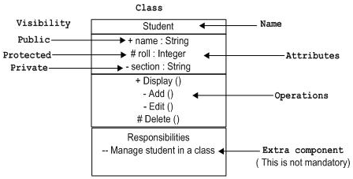

> https://www.uml-diagrams.org/class-diagrams-overview.html

## Domain Model Diagram

Domain diagram overview - classes, interfaces, associations, usage, realization, multiplicity.

## Diagram of Implementation Classes

     

Elements of implementation class diagram - classes, interfaces, associations, usage, realization.

 

##### 类注释:

下面的图表示的 UML 类，该图被分为四个部分。

第一个是顶端部分被用来命名类。

第二个是用来显示类的属性。

​	格式：`可见性 名称：类型[=默认值]`

第三部分是用来描述由类执行的操作。

​	格式：`可见性 名称（参数列表 参数1，参数2） ：返回类型`

第四部分是可选的显示附加组件。

​                  

 **在UML类图中，常见的有以下几种关系: 泛化（Generalization）, 实现（Realization），关联（Association)，聚合（Aggregation），组合(Composition)，依赖(Dependency)。**

**各种关系的强弱顺序： 泛化 = 实现 > 组合 > 聚合 > 关联 > 依赖**

* 类与类之间关系表示

* 例子

  

  

